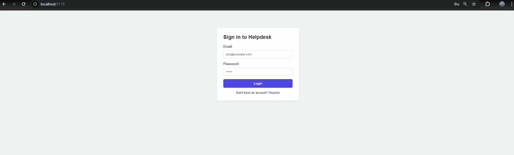
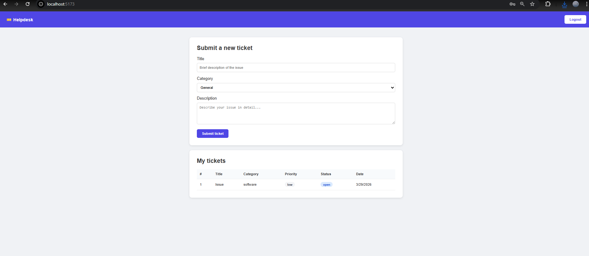
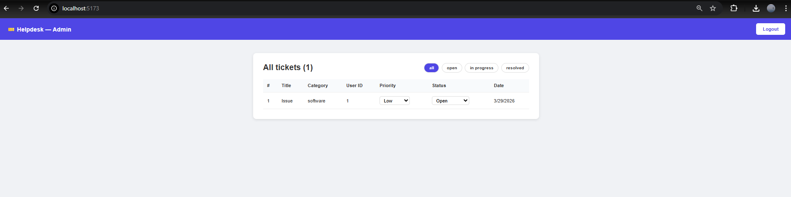
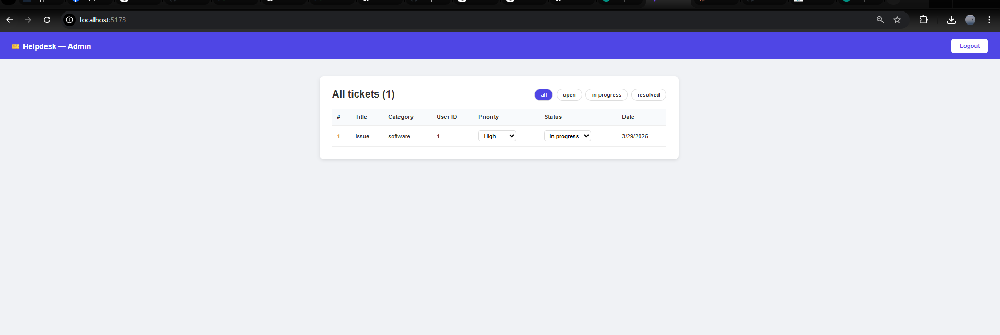

# 🎫 Helpdesk Ticketing System

A full-stack IT support ticket management system built with FastAPI and React.
## 🌐 Live Demo

**[Open the app](https://helpdesk-frontend-iqkc.onrender.com)**

> Note: First load may take 30 seconds as the free server wakes up.

**Test credentials:**
- Admin: `admin@test.com` / `123456`
- User: `user@test.com` / `123456`

## Screenshots

### Login


### User Dashboard


### Admin Dashboard


### Ticket Updated


## Features

- User registration and login with JWT authentication
- Users can submit support tickets with category and description
- Users can track the status of their own tickets
- Admin dashboard to manage all tickets
- Admins can update ticket priority (low / medium / high) and status (open / in progress / resolved)
- Filter tickets by status
- 10 automated tests with pytest covering auth and ticket logic

## Tech Stack

**Backend:** Python, FastAPI, SQLAlchemy, SQLite, JWT, bcrypt  
**Frontend:** React, Vite, Axios, React Router  
**Testing:** pytest, httpx

## Project Structure
```
helpdesk/
├── backend/
│   ├── main.py          # App entry point
│   ├── database.py      # Database models
│   ├── auth.py          # Authentication routes
│   ├── tickets.py       # Ticket routes
│   └── test_app.py      # pytest test suite (10 tests)
└── frontend/
    └── src/
        ├── App.jsx
        ├── Login.jsx
        ├── UserDashboard.jsx
        └── AdminDashboard.jsx
```

## Running Locally

**Backend:**
```bash
cd backend
python -m venv venv
venv\Scripts\activate
pip install -r requirements.txt
uvicorn main:app --reload
```

**Frontend:**
```bash
cd frontend
npm install
npm run dev
```

**Tests:**
```bash
cd backend
pytest test_app.py -v
```

## API Endpoints

| Method | Endpoint | Access | Description |
|--------|----------|--------|-------------|
| POST | /auth/register | Public | Create account |
| POST | /auth/login | Public | Login and get token |
| POST | /tickets/ | User | Submit a ticket |
| GET | /tickets/my | User | Get my tickets |
| GET | /tickets/all | Admin | Get all tickets |
| PATCH | /tickets/{id} | Admin | Update priority/status |

## Test Results
```
test_register_success          PASSED
test_register_duplicate_email  PASSED
test_login_success             PASSED
test_login_wrong_password      PASSED
test_submit_ticket             PASSED
test_user_sees_only_own_tickets PASSED
test_admin_sees_all_tickets    PASSED
test_regular_user_cannot_see_all_tickets PASSED
test_admin_can_update_ticket   PASSED
test_user_cannot_update_ticket PASSED

10 passed in 12.84s
```
